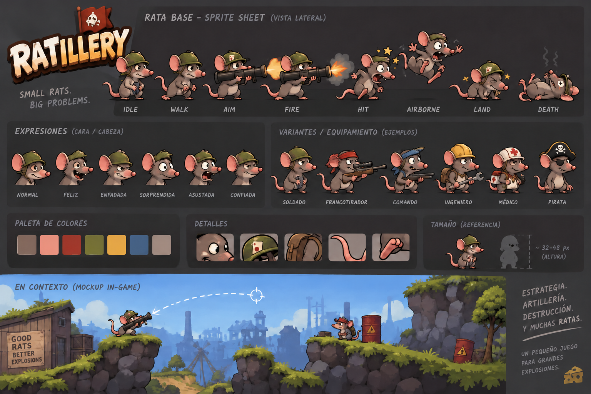

# Ratillery

> Tiny rats. Massive damage.

Ratillery is a 2D turn-based tactical strategy game starring military rats,
conceptually inspired by games like Worms but with its own identity:
artillery, ballistic physics, destructible terrain, and cartoon visual humor.

## Concept art

Early/conceptual illustrations of characters, weapons, terrain, and gameplay:



## Stack

- C# / .NET 10
- [MonoGame](https://monogame.net/) (DesktopGL)
- xUnit for domain logic unit tests

## Commands

```bash
dotnet restore
dotnet build
dotnet test
dotnet run --project src/Ratillery.Game
```

## Structure

```text
Ratillery/
│
├── src/
│   ├── Ratillery.Game/     # Game loop, rendering, input, scenes (MonoGame)
│   └── Ratillery.Core/     # Rules, entities, ballistics, turns (no MonoGame)
│
├── tests/
│   └── Ratillery.Core.Tests/
│
├── assets/                 # Sprites, terrain, weapons, effects, UI, audio
│
└── docs/
```

### Separation of responsibilities

- **Ratillery.Core**: logic testable without a graphics window (ballistics,
  damage, entities, world state).
- **Ratillery.Game**: MonoGame integration (game loop, rendering, input,
  asset loading, animations, scenes).

## Agentic architecture

Development is orchestrated through a graph of agents defined in
`.opencode/agents/` and `.opencode/skills/` (opencode):

```text
PRODUCT_REQUEST
    -> functional-analyst   (story + acceptance criteria -> docs/stories/)
    -> developer            (implements on feat/<STORY-ID>-<slug>)
    -> qa                   (adversarial validation: PASS / FAIL / BLOCKED)

QA PASS + DEV_APPROVED + ANALYST_APPROVED
    -> merge --no-ff to main -> DONE
```

Design principles:

- **Graph orchestration, not chat**: an `orchestrator` agent routes work
  between specialized subagents (max. 3 dev↔QA cycles, then escalate to the
  human).
- **Coordination through artifacts**: agents don't talk to each other; they
  communicate via versioned files (stories, QA reports, ADRs).
- **Separation of responsibilities**: the analyst doesn't code, QA doesn't
  edit code, the developer doesn't decide gameplay rules.
- **Explicit escalation**: decisions are classified into levels (L1 internal,
  L2 architecture with ADR, L3 product — always human).
- **Protected `main`**: only work validated by the three approvals gets in.

Details in [`docs/agents/graph.md`](docs/agents/graph.md) and
[`AGENTS.md`](AGENTS.md). Development status: [`docs/status.md`](docs/status.md)
· Product vision: [`docs/product/vision.md`](docs/product/vision.md)
